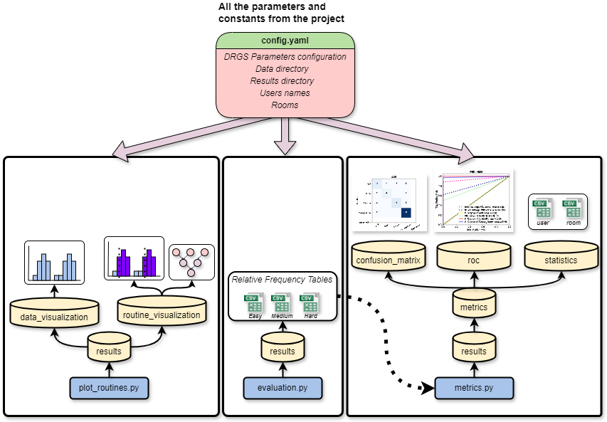

# Detecting Routines from nursery home residents

## Install dependencies

Install all the dependencies in the requirements.txt file.

```bash
cd setup
pip install -r requirements.txt
```

Or create a new virtual environment with the dependencies.

```bash
cd setup
conda env create --name <env_name> --file = config.yml
```

Where `<env_name>` is the name of the environment.

## Data

The data used in this project is a synthetic dataset generated using our application web [Synthetic Activity Generation](https://javiergavina.github.io/Synthetic-Activity-Dataset/) using the metadata found on `data/<user>/metada`.  The data is stored in the `data` directory.

## How to run the program

### Routine detection and visualization

To run the routine detection and visualization, run the following command:

```bash
python plot_routines.py
```

This code will save on the `results` file the results of the routine execution.

The parameters, directory of data and the name of the results directory are on the `config.yaml` file.

### Run the frequency table extraction

To run the frequency table extraction from the results of the routine execution, run the following command:

```bash
python evaluation.py
```


### Run the metrics calculation

To run the table calculation of ROC AUC, F1 Score, Precision, Recall, ROC plots and confusion matrix from the results of the routine execution, run the following command:

```bash
python metrics.py
```

## Workflow scheme



The program operates as follows:

1. **plot_routines.py**: This script runs the DRGS routine detection algorithm using parameters specified in `config.yaml` and plots the hierarchical routines graph and each cluster detected. 

2. **evaluation.py**: If you want to validate the results and calculate classification metrics for the detected hierarchical routines based on the `config.yaml` parameters, run this script first. It generates a table of relative frequencies for each difficulty level in the data. These tables show the probability of being in a room at different times of the week, based on the detected routines.

3. **metrics.py**: Finally, to compare these frequency tables with the ground truth (found in `data/groundtruth.csv`), run this script. It extracts classification metrics, ROC curves, and confusion matrices.

In summary:
- Run `plot_routines.py` to detect routines.
- Run `evaluation.py` to generate frequency tables.
- Run `metrics.py` to calculate and compare metrics with the ground truth.

